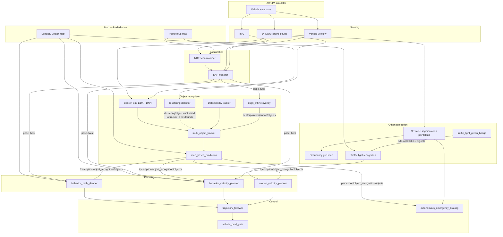

# Autoware perception & vehicle inputs (AWSIM + universe-cuda-humble)

What the autonomous stack **receives** and how data flows from simulation sensors to planning and control.  
Based on the live graph captured in `logs/nodes_with_dsgn_offline.txt` and `logs/topics_with_dsgn_offline.txt` (with `dsgn_offline` running).

See also: [STACK_AUDIT.md](STACK_AUDIT.md) (full node/topic inventory + evidence levels) · [DSGN_OFFLINE_RUNBOOK.md](DSGN_OFFLINE_RUNBOOK.md) · [DEBUG_LOG.md](DEBUG_LOG.md)

**Important:** A node/topic **existing** or being **wired** is not the same as being **fed** or **used** — see STACK_AUDIT §1.

---

## 1. Big picture — all inputs to the driving stack



**Takeaway:** The car does not have a single “perception output.” Planners consume **predicted 3D objects**, **maps**, **ego pose**, and **traffic-light states**; control also sees **raw obstacle point clouds** for AEB.

---

## 2. Sensing inputs (from AWSIM)

| Source | Main topics | Used by |
|--------|-------------|---------|
| Top / left / right LiDAR | `/sensing/lidar/*/pointcloud` → concatenated `/sensing/lidar/concatenate_data/pointcloud` | Localization NDT, CenterPoint, clustering, obstacle segmentation |
| IMU | `/sensing/imu/imu_data` (via corrector chain) | Gyro odometer, EKF |
| Vehicle | `/vehicle/status/velocity_status`, steering, etc. | EKF twist, control feedback |
| Clock | `/clock` | Entire stack (sim time) |

**Publisher:** AWSIM only. Do not publish fake `/clock` or `/vehicle/status/*`.

---

## 3. Map inputs (static, from `data/maps/`)

| Topic | Content | Consumers |
|-------|---------|-----------|
| `/map/vector_map` | Lanelet2 lanes, traffic rules, traffic-light registries | Mission planning, behavior planners, prediction, TL map detector |
| `/map/pointcloud_map` | NDT / compare-map point cloud | NDT scan matcher, map filters in detection |
| `/map/map_projector_info` | MGRS projector (54SUE, Nishi-Shinjuku) | All map-frame geometry |

---

## 4. Localization inputs

| Topic | Producer | Role |
|-------|----------|------|
| `/localization/pose_with_covariance` | EKF (fused) | **dsgn_offline** frame index; planners; RViz |
| `/localization/kinematic_state` | EKF | Motion planning, control |
| `/localization/twist_estimator/twist_with_covariance` | Gyro odometer | EKF measurement |

**Pipeline:** LiDAR + map → **NDT scan matcher** → pose estimate → **EKF localizer** (+ IMU/wheel) → fused pose/twist.

**Lab note:** `ndt_scan_matcher.param.yaml` is bind-mounted from `data/autoware_data/` — required on this map (see DEBUG_LOG.md).

---

## 5. Object recognition pipeline (dynamic actors)

This is the path that turns detections into **bounding boxes the motion planner uses for stop / slow / cruise**.

### 5.1 Detection sources (parallel)

| Source | Node | Output topic | Feeds tracker? |
|--------|------|--------------|----------------|
| **CenterPoint** (LiDAR DNN) | `lidar_centerpoint` | `/perception/.../centerpoint/objects` | Via validator → `.../centerpoint/validation/objects` |
| **Validator** | `obstacle_pointcloud_based_validator_node` | `/perception/.../centerpoint/validation/objects` | **Yes** — `multi_object_tracker` subscribes here |
| **Clustering** | `euclidean_cluster` → `shape_estimation` → `detected_object_feature_remover` | `/perception/.../clustering/objects` | **No** (0 subscribers in our capture) |
| **Detection by tracker** | `detection_by_tracker_node` | `/perception/.../detection_by_tracker/objects` | **Yes** |
| **Camera-only** | (launch-dependent) | `/perception/.../camera_only/objects` | **Yes** (subscriber exists; may be idle in AWSIM) |
| **dsgn_offline** (overlay) | `dsgn_offline` | Same as validator topic by default | **Yes** — shares `centerpoint/validation/objects` |

**Important wiring (fixed in our fork):**

- `multi_object_tracker` **does not** subscribe to `/perception/object_recognition/detection/objects` (legacy / unused merged topic).
- `dsgn_offline` must publish to **`/perception/object_recognition/detection/centerpoint/validation/objects`** (param `detection_topic`).

### 5.2 Tracking → prediction

```text
DetectedObjects (multiple sources)
        ↓
multi_object_tracker
        ↓  /perception/object_recognition/tracking/objects  (TrackedObjects)
map_based_prediction  (+ lanelet map)
        ↓  /perception/object_recognition/objects  (PredictedObjects)  ← planners use this
```

| Stage | Topic | Message type |
|-------|-------|----------------|
| Tracked | `/perception/object_recognition/tracking/objects` | `TrackedObjects` |
| Predicted | `/perception/object_recognition/objects` | `PredictedObjects` |

**RViz:** Use `/perception/object_recognition/objects` to visualize what **planning** sees.

### 5.3 Who subscribes to predicted objects?

From `ros2 topic info -v /perception/object_recognition/objects`:

| Node | Package area |
|------|----------------|
| `behavior_path_planner` | Lane change, avoidance, goal |
| `behavior_velocity_planner` | Intersections, crosswalks, traffic rules |
| `motion_velocity_planner` | **obstacle_stop**, obstacle_slow_down, obstacle_cruise |
| `autonomous_emergency_braking` | Emergency braking on objects + pointcloud |
| `collision_detector` | Control-layer collision check |
| `costmap_generator` | Parking / freespace |
| `planning_evaluator`, `control_evaluator` | Metrics |
| AD API `perception` | External API surface |

**Verified experiment:** Stopping `dsgn_offline` removes fictitious cars from this chain; obstacle-stop behavior changes accordingly.

---

## 6. Obstacle segmentation (parallel path — not dsgn)

LiDAR points classified as obstacles, **without** going through object detectors.

| Topic | Role |
|-------|------|
| `/perception/obstacle_segmentation/pointcloud` | Obstacle points in sensor frame |
| `/perception/obstacle_segmentation/pointcloud_map_filtered/downsampled/pointcloud` | Map-filtered obstacles |
| `/perception/occupancy_grid_map/map` | 2D occupancy grid |

**Consumers:** Parking costmap, some validators, **AEB** (`/control/autonomous_emergency_braking/debug/obstacle_pointcloud`).  
Disabling dsgn does **not** remove this path — real/sim LiDAR obstacles can still trigger AEB.

---

## 7. Traffic light recognition

| Stage | Topic |
|-------|-------|
| Camera + map-based ROIs | `/perception/traffic_light_recognition/traffic_light/detection/rois` |
| Classifiers (car / ped) | `.../classification/*/traffic_signals` |
| Fused output | `/perception/traffic_light_recognition/traffic_signals` |

**Lab overlay:** `traffic_light_green_bridge.py` publishes GREEN on `/perception/traffic_light_recognition/external/traffic_signals` so the car does not halt at every intersection during straight-line tests.

**Consumer:** `behavior_velocity_planner` (intersection / traffic-light modules).

---

## 8. Planning & control outputs (what actually moves the car)

| Topic | Meaning |
|-------|---------|
| `/planning/scenario_planning/trajectory` | Planned path + speeds |
| `/planning/planning_factors/obstacle_stop` | Why obstacle stop triggered |
| `/control/command/control_cmd` | Longitudinal / lateral command |
| `/vehicle/status/velocity_status` | Actual speed |

**Debug chain check (inside Docker):**

```bash
bash /home/aw/autoware_data/dsgn_chain_check.sh
bash /home/aw/autoware_data/diagnose_stuck.sh
```

---

## 9. dsgn_offline injection summary

| Item | Value |
|------|-------|
| Subscribes | `/localization/pose_with_covariance` |
| Publishes | `DetectedObjects` on `detection_topic` (default: `centerpoint/validation/objects`) |
| Sync | Nearest row in `path.txt` → `NNNNNN.txt` KITTI-format detections |
| Frame | `base_link` |
| Rate | 10 Hz |

**Attack surfaces documented in runbook:** output-space edits to `awsim_output_*.txt`; later image-space DSGN inference.

---

## 10. Freezing the ROS graph (snapshots)

Logs live on the **host** at `~/summer26/logs/` (not under `data/`).

**inside Docker** (requires `logs` volume mount — see README):

```bash
mkdir -p /home/aw/logs
ros2 topic list > /home/aw/logs/topics_snapshot.txt
ros2 node list  > /home/aw/logs/nodes_snapshot.txt
```

**host:** files appear immediately at `~/summer26/logs/`.

Or use:

```bash
bash /home/aw/scripts/freeze_ros_graph.sh my_label
```

---

## 11. Quick reference — topics to probe

| Question | Command |
|----------|---------|
| Who publishes detections? | `ros2 topic info -v /perception/object_recognition/detection/centerpoint/validation/objects` |
| Tracker inputs | `ros2 node info /perception/object_recognition/tracking/multi_object_tracker` |
| What planners see | `ros2 topic echo /perception/object_recognition/objects --once` |
| Obstacle stop active? | `ros2 topic echo /planning/planning_factors/obstacle_stop --once` |
| Full graph | `logs/topics_with_dsgn_offline.txt`, `logs/nodes_with_dsgn_offline.txt` |
